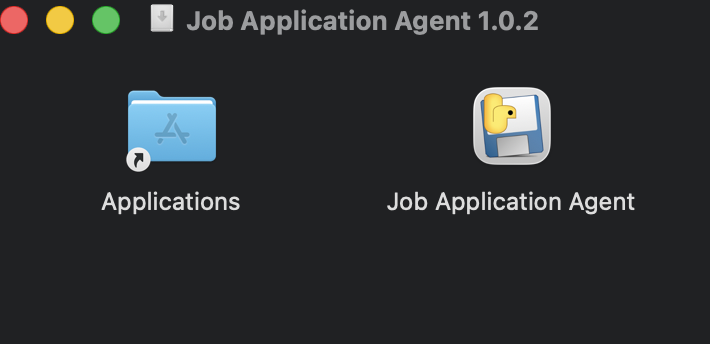
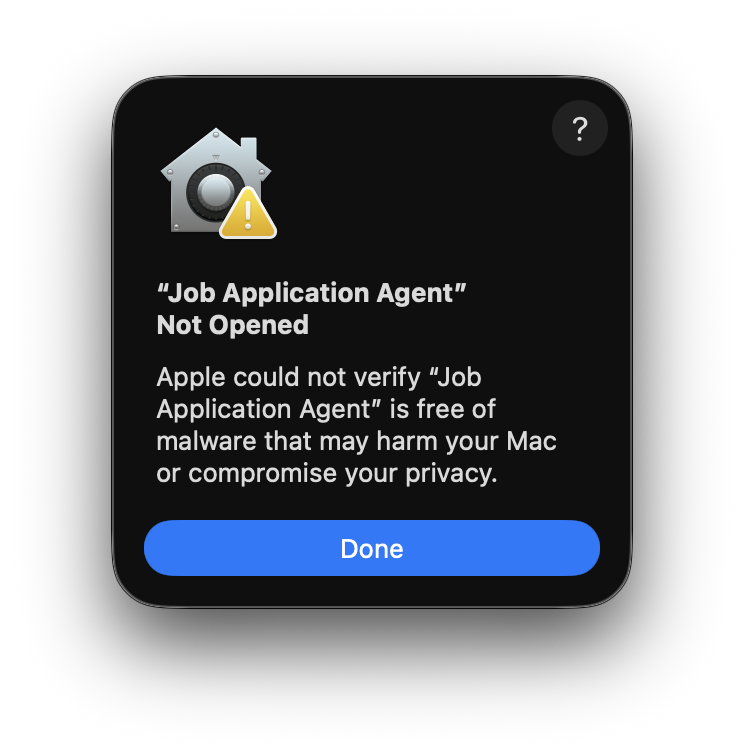
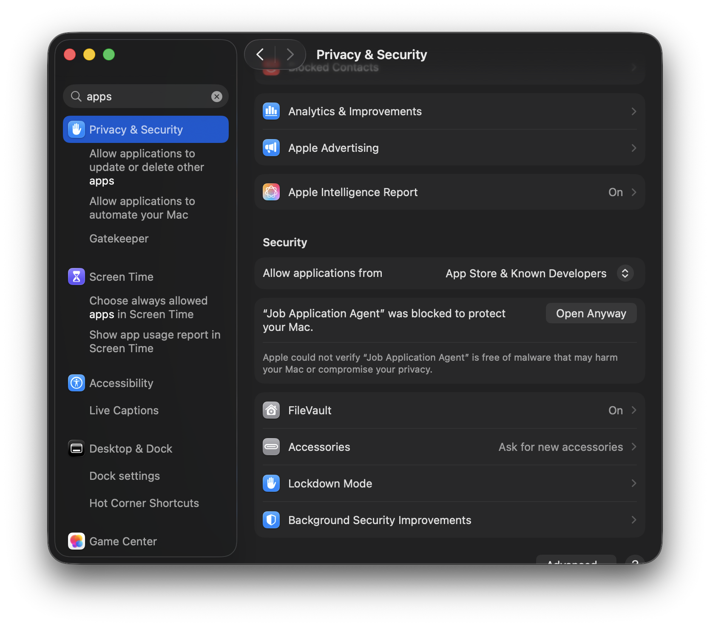
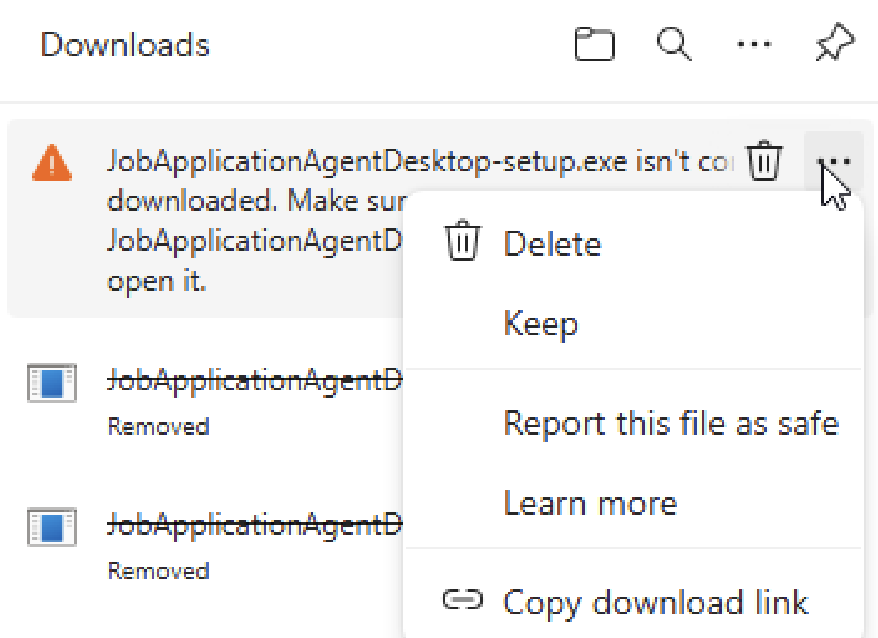
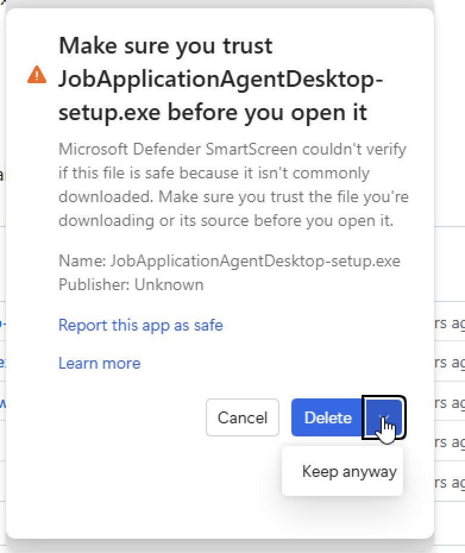
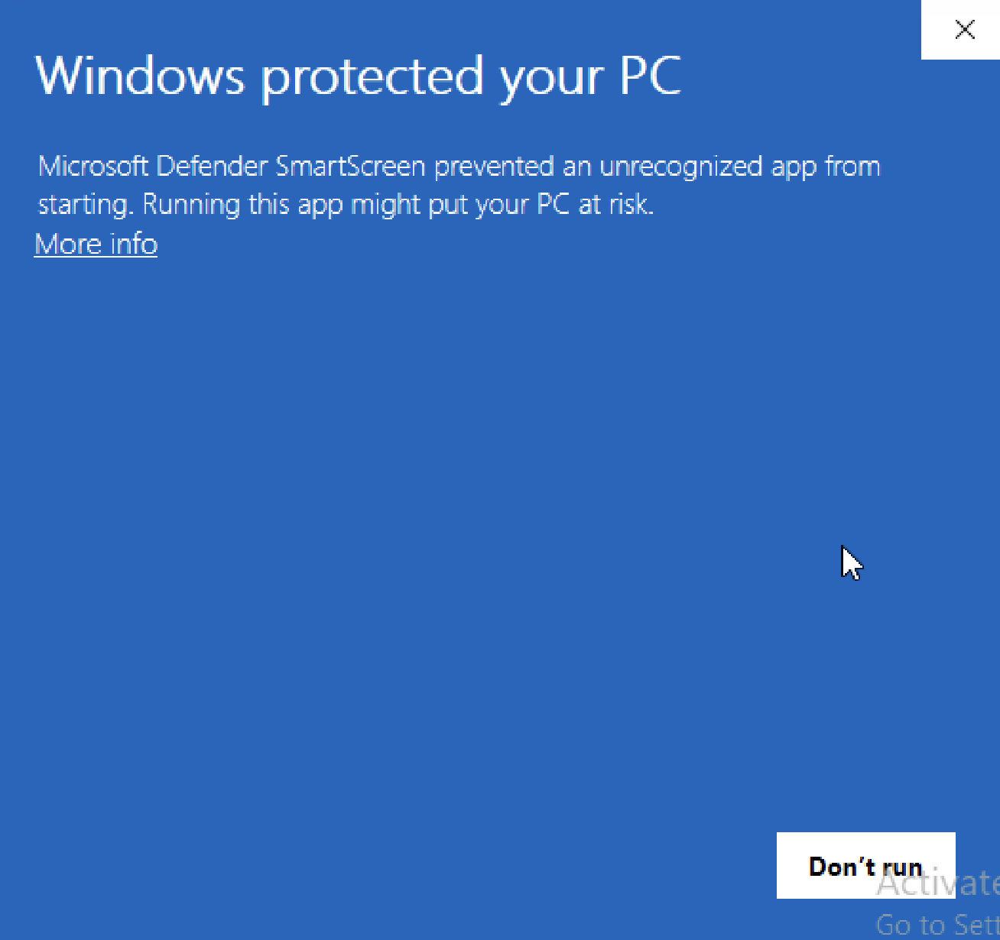
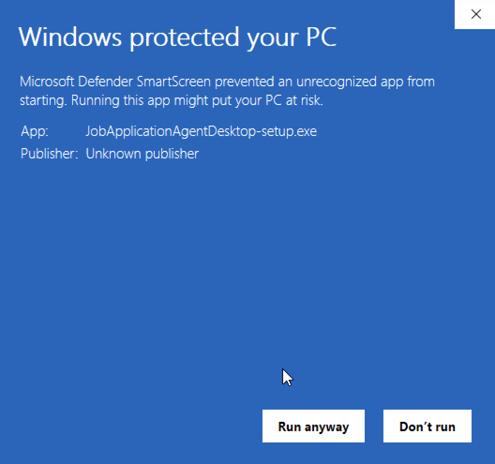
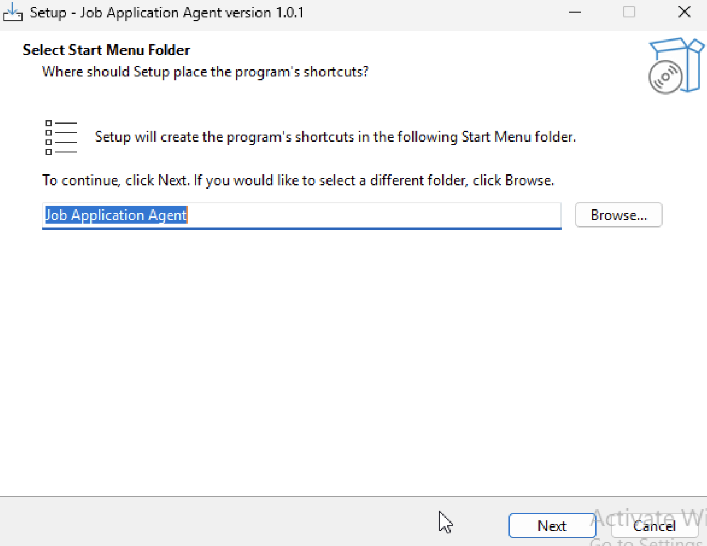

# Job Application Agent


**An AI-guided job search workspace that helps you find higher-trust job postings, evaluate fit against your real background, and move faster from search to application.**

> Current release: **1.0.4**
>
> Status: **Experimental, usable, and actively tested**

## Why It Stands Out

- **AI-guided search and fit analysis**: refine title targeting, score jobs against your background, understand why a role fits, and generate tailored cover letters.
- **Higher-trust job discovery**: prioritize direct employer and ATS-linked postings whenever possible instead of aggregator pass-throughs.
- **Faster search-to-application workflow**: move from discovery to review to application support in one place.

## At A Glance

| Area | What you get |
| --- | --- |
| Discovery | AI-guided title refinement, search expansion, and higher-trust employer/ATS discovery |
| Review | Fit scoring, rationale, risks, filtering, and New Roles review workflow |
| Application | Tailored cover letters and applied-role tracking |
| Storage | SQLite-first local storage, local OpenAI key handling, backups, and reset tools |
| Onboarding | Setup Wizard plus a full Pipeline view for ongoing runs |

## Download Overview

| Platform | Primary package | Fallback package |
| --- | --- | --- |
| macOS | [DMG 1.0.4](https://github.com/hunterthesavage/job_application_agent/releases/download/desktop-wrapper-test/JobApplicationAgent-macos-desktop-wrapper-1.0.4.dmg) | [ZIP 1.0.4](https://github.com/hunterthesavage/job_application_agent/releases/download/desktop-wrapper-test/JobApplicationAgent-macos-desktop-wrapper-1.0.4.zip) |
| Windows | [Installer 1.0.4](https://github.com/hunterthesavage/job_application_agent/releases/download/desktop-wrapper-test/JobApplicationAgentDesktop-setup-1.0.4.exe) | [ZIP 1.0.4](https://github.com/hunterthesavage/job_application_agent/releases/download/desktop-wrapper-test/JobApplicationAgentDesktop-windows-1.0.4.zip) |

---

## macOS Setup

### Option 1) Download The macOS Disk Image

1. Downloaded [macOS DMG 1.0.4](https://github.com/hunterthesavage/job_application_agent/releases/download/desktop-wrapper-test/JobApplicationAgent-macos-desktop-wrapper-1.0.4.dmg).
2. Double-click on `Job Application Agent`
   
3. On first launch, macOS may block the app and show a security warning. Click `Done` for now.
   
4. Open `System Settings -> Privacy & Security`, scroll down to the `Allow applications...` area, and click `Open Anyway`.
   
5. The App should now launch

### Option 2) Download The macOS Zip

If the `.dmg` does not work on this machine, use the zip instead:

- [macOS Zip 1.0.4](https://github.com/hunterthesavage/job_application_agent/releases/download/desktop-wrapper-test/JobApplicationAgent-macos-desktop-wrapper-1.0.4.zip)

1. Download and unzip the fallback package.
2. Move `Job Application Agent.app` into `Applications`.
3. Open the app from `Applications`.
4. If macOS warns that the app is from an unidentified developer, approve it in:
   - `System Settings -> Privacy & Security`

<details>
<summary><strong>Source install fallback</strong></summary>

If you need to run directly from the repo instead of the packaged desktop app:

```bash
cd ~ && ( [ -d job_application_agent/.git ] || git clone https://github.com/hunterthesavage/job_application_agent.git job_application_agent ) && cd ~/job_application_agent && chmod +x install_mac.sh run_app.sh install_mac.command run_app.command && ./install_mac.sh
```

</details>

---

## Windows Setup

### Option 1) Step-By-Step Windows Install

1. Download [Windows Installer 1.0.4](https://github.com/hunterthesavage/job_application_agent/releases/download/desktop-wrapper-test/JobApplicationAgentDesktop-setup-1.0.4.exe).
2. After the download finishes, you may get this warning. Click the 3 dots `...` and choose Keep.
   
3. You may also get this Trust warning. Click the drop down and choose 'Keep anyway'.
   
4. If the Microsoft Defender comes up, choose `More Info`.
   
5. Click `Run anyway`.
   
6. Walk through the installer. The default Start Menu folder and install location are fine in most cases.
   
9. Finishing the installer should launch the App. Note: you should not have to go through the Security steps once it's installed.

> These prompts are expected right now because the installer is not code-signed yet.
>
> Your app data is stored separately from the install folder, so reinstalling does not wipe your jobs or settings unless you remove the app data folder too.

### Option 2) Download The Windows Zip

If the installer does not work on this machine, use the zip instead:

- [Windows Zip 1.0.4](https://github.com/hunterthesavage/job_application_agent/releases/download/desktop-wrapper-test/JobApplicationAgentDesktop-windows-1.0.4.zip)

### Step-By-Step Windows Zip Fallback

1. Download the Windows zip package.
   
2. Extract the zip.
   
3. Open the extracted folder.
   
4. If Windows shows a SmartScreen warning when you launch the app, use `More info` and then `Run anyway`.
   
5. If Windows Defender Firewall asks for permission, allow access so the local app window can load.
   

<details>
<summary><strong>Manual Windows source fallback</strong></summary>

If you are running directly from the repo instead of the desktop package:

1. Install **Python x64 3.13**
2. Download the repo zip
3. Run `install_windows.bat`
4. Launch with `run_app_windows.bat`

Exact installer:

- [Python 3.13.12 Windows installer (64-bit)](https://www.python.org/ftp/python/3.13.12/python-3.13.12-amd64.exe)

</details>

<details>
<summary><strong>Maintainer packaging notes</strong></summary>

Build the desktop package with:

```powershell
.\scripts\build_windows_desktop.ps1 -BuildInstaller
```

More details:

- `docs/desktop-wrapper-spike.md`

</details>

## First launch

On first launch, the app should open to the Setup Wizard when there are no jobs and setup has not been completed.

## What The App Does

- AI-guided title refinement and search expansion
- AI-assisted fit scoring against your resume and profile context
- Tailored cover-letter generation for selected roles
- Discovery pipeline that prioritizes higher-trust employer and ATS-linked job postings
- Setup Wizard for first-time onboarding
- Pipeline view for run inputs and job discovery actions
- New Roles review workflow with sorting and filtering
- Applied Roles tracking
- SQLite-first local storage
- Local OpenAI key handling
- Backup, health, and reset tooling

## Local Data And Reset

Local runtime state that should not be committed:

- `data/job_agent.db`
- `data/openai_api_key.txt`
- `data/openai_api_key.meta.json`
- `data/openai_api_state.json`
- `backups/`
- `logs/`
- `.env`

Use:

- **Settings -> Configuration -> Reset App / Remove All Data**

That resets local app state and returns the app to Setup Wizard.

## Repo Structure

- `app.py` - main Streamlit entrypoint
- `views/` - Streamlit views
- `services/` - business logic
- `ui/` - shared UI helpers
- `src/` - utility scripts
- `tests/` - test suite
- `config.py` - shared config and paths

## Release Validation

For a soft-launch checkpoint, run the release checks:

```bash
source .venv/bin/activate
./scripts/run_release_checks.sh
```

Use the full checklist in:

- `docs/soft-launch-checklist.md`

## Troubleshooting

### App launches but crashes with a SQLite column error

That usually means the local database is older than the current code. Because the app is local-first, the simplest fix is to remove the local runtime DB and let the app recreate it:

```bash
rm -f data/job_agent.db jobs.db
```

Then relaunch:

```bash
./run_app.sh
```

### Streamlit command not found

Make sure the virtual environment is active or use the launcher:

```bash
./run_app.sh
```

### Fresh install proof

A clean GitHub clone test is the best way to validate install behavior before sharing the repo more broadly.
