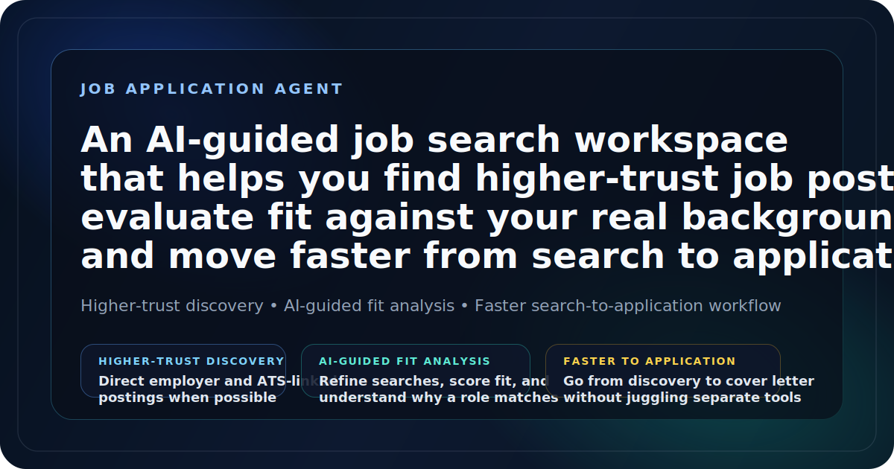
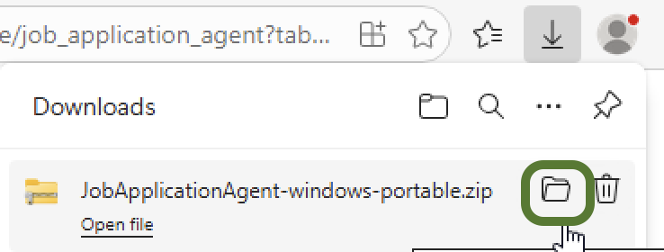
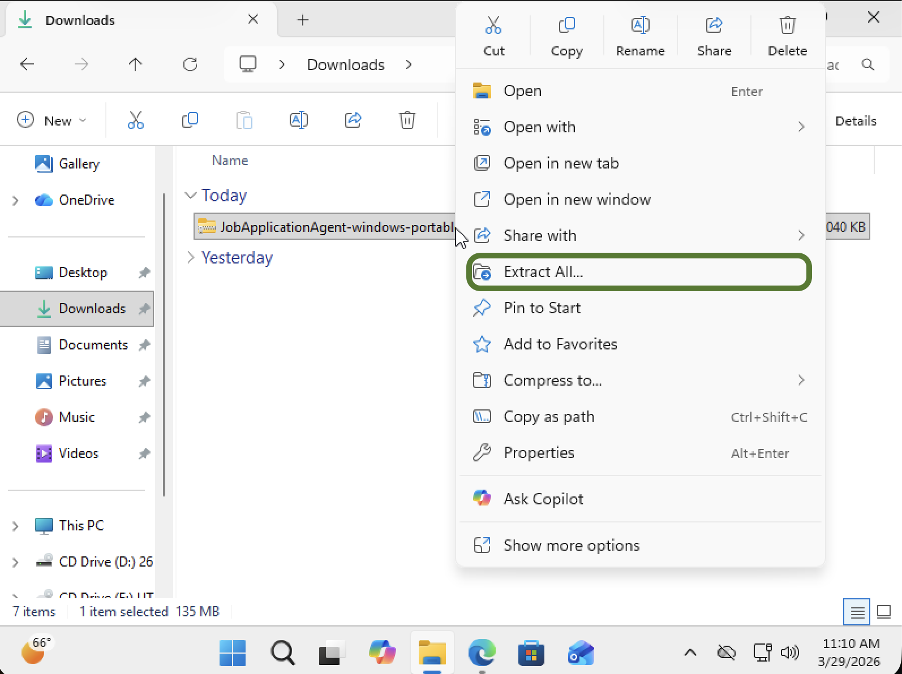
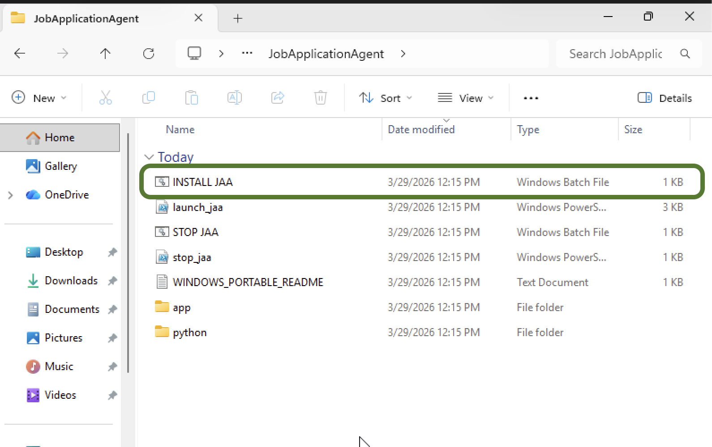
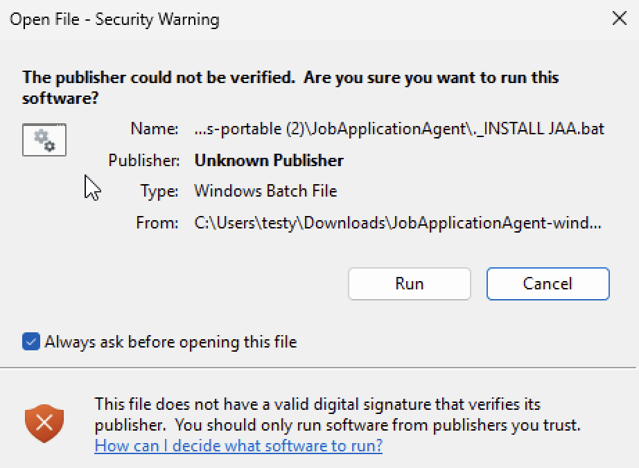
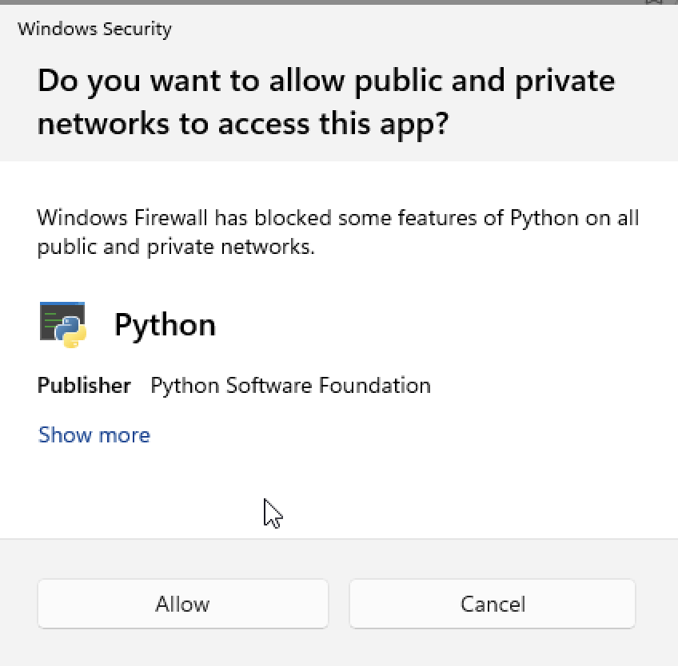

# Job Application Agent



**An AI-guided job search workspace that helps you find higher-trust job postings, evaluate fit against your real background, and move faster from search to application.**

## Why it is different

- **AI-guided search and fit analysis**: use AI to refine title targeting, score jobs against your background, understand why a role fits, and generate tailored cover letters.
- **Higher-trust job discovery**: surface direct employer and ATS-linked postings when possible, not just aggregator pass-throughs.
- **Faster search-to-application workflow**: move from job discovery to fit review to application support in one place instead of bouncing across tools.

## Status

This project is currently **experimental**.

It is usable and actively tested, but:
- The workflow is still evolving
- AI-assisted behaviors may change between releases

## Version

Current release: **1.0.0**

## What it does

- AI-guided title refinement and search expansion
- AI-assisted fit scoring against your resume and profile context
- Tailored cover-letter generation for selected roles
- Discovery pipeline that prioritizes higher-trust employer and ATS-linked job postings
- Setup Wizard for first-time onboarding
- Pipeline view for run inputs and job discovery actions
- New Roles review workflow with sorting and filtering
- Applied Roles tracking
- SQLite-first local storage
- Local OpenAI key handling
- Backup, health, and reset tooling


# macOS Setup

### Step 1) Install App

Open the `Terminal` app and copy and paste this whole command:

```bash
cd ~ && ( [ -d job_application_agent/.git ] || git clone https://github.com/hunterthesavage/job_application_agent.git job_application_agent ) && cd ~/job_application_agent && chmod +x install_mac.sh run_app.sh install_mac.command run_app.command && ./install_mac.sh
```

What this does:
- downloads the app into your home folder if it is not already there
- moves into the correct project folder
- fixes launcher permissions
- installs the required packages
- prepares the app to launch locally

### Step 2) Launch App 

After setup is complete, either:

- double-click `run_app.command`

or run:

```bash
cd ~/job_application_agent
./run_app.sh
```

### If `run_app.command` is blocked later

Because this app is unsigned, macOS Gatekeeper may still warn the first time you open the launcher by double-clicking it.

If that happens:
1. In Finder, `Control`-click or right-click `run_app.command`
2. Click `Open`
3. Click `Open` again in the warning dialog


# Windows Setup

### Step 1) Download The Windows Package

Current Windows Package:

- [Windows Install Zip](https://github.com/hunterthesavage/job_application_agent/releases/download/windows-portable-current/JobApplicationAgent-windows-portable.zip)


### Step 2) Extract The Zip

1. Open File Explorer.
   
  

2. Find the zip you downloaded.
3. Click the zip once to highlight it.
4. Use one of these options:
   - click `Extract all` in the File Explorer toolbar
   - or right-click the zip and click `Extract All...`
5. Click `Extract`.
  

### Step 3) Start The App

1. Open the extracted `JobApplicationAgent` folder.
2. Double-click `INSTALL JAA.bat`.
   
  
3. If Windows asks whether to run the file, click `Run`.
   
  
4. If Windows Security asks about Python network access, click `Allow`.
   
  
5. Wait a few seconds for the browser to open.

The app should open in your browser at:

- [http://localhost:8505](http://localhost:8505)

When you are done:

- for the current test package, click `Close Application` inside the app or double-click `STOP JAA.bat`
- for the fallback known-good package, close the browser tab and then close the Command Prompt window that launched with the app

### Fallback Windows Package

Fallback Download Link if the current package does not install on this machine:

- [Older Install Zip File](https://github.com/hunterthesavage/job_application_agent/releases/download/windows-portable-latest/JobApplicationAgent-windows-portable.zip) - known-good Windows recovery package

### Manual fallback setup

If you are running directly from the repo instead of the portable package, use the existing Python-based setup:

1. Install **Python x64 3.13**
2. Download the repo zip
3. Run `install_windows.bat`
4. Launch with `run_app_windows.bat`

Exact installer:

- [Python 3.13.12 Windows installer (64-bit)](https://www.python.org/ftp/python/3.13.12/python-3.13.12-amd64.exe)

Maintainers can build the portable package with:

```powershell
.\scripts\build_windows_portable.ps1
```

More details:

- `docs/windows-portable-build.md`

### Windows packaging status

The current Windows package above is the most up-to-date live package. The older known-good recovery package remains linked as the fallback option if the current package has trouble on a tester machine.

## First launch

On first launch, the app should open to the Setup Wizard when there are no jobs and setup has not been completed.

## Repo structure

- `app.py` - main Streamlit entrypoint
- `views/` - Streamlit views
- `services/` - business logic
- `ui/` - shared UI helpers
- `src/` - utility scripts
- `tests/` - test suite
- `config.py` - shared config and paths

## Local-only state

These files and folders are local runtime state and should not be committed:

- `data/job_agent.db`
- `data/openai_api_key.txt`
- `data/openai_api_key.meta.json`
- `data/openai_api_state.json`
- `backups/`
- `logs/`
- `.env`

## Public repo note

This repository is designed to be safe to share publicly as a local-first app.

It does **not** expect you to commit:
- your local database
- saved OpenAI API keys
- backups or logs

## Release Candidate Validation

For a soft-launch checkpoint, run the release checks:

```bash
source .venv/bin/activate
./scripts/run_release_checks.sh
```

Use the full checklist in:

- `docs/soft-launch-checklist.md`

## Clean reset

Use:
- **Settings → Configuration → Reset App / Remove All Data**

That resets local app state and returns the app to Setup Wizard.

## Troubleshooting

### App launches but crashes with a SQLite column error

That usually means the local database is older than the current code. Because the app is local-first, the simplest fix is to remove the local runtime DB and let the app recreate it:

```bash
rm -f data/job_agent.db jobs.db
```

Then relaunch:

```bash
./run_app.sh
```

### Streamlit command not found

Make sure the virtual environment is active or use the launcher:

```bash
./run_app.sh
```

### Fresh install proof

A clean GitHub clone test is the best way to validate install behavior before sharing the repo more broadly.
